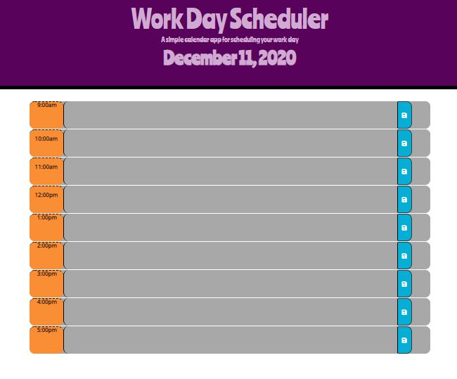

# Day-Planner
>> Schedule your day by the hour

The user has the ability to type in the hour blocks all their tasks for the day.

## SCREENSHOT

## Features

- Type in the hour block and it will save to local storage
- Refresh page and it will still be there!
- Once the hour has passed, the block will turn to grey; current hour is in red and future is in green

## Link

https://kmsaunders7.github.io/Day-Planner/